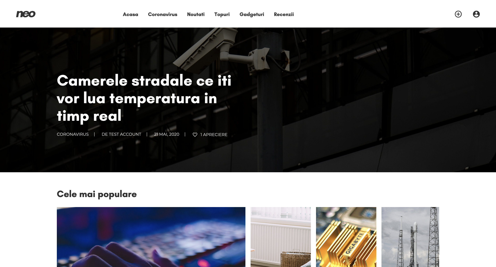

`2020 Series`
# neo - Tech News CMS - My project for the Web subject from university
neo was a simple project for the Web subject in my university that has been created in a week - from top to bottom. It got a 10 out of 10.

### Development
* HTML5
* CSS3
* PHP
* JavaScript/jQuery

---

### Other Links
* Personal website: [https://xsuve.com/](https://xsuve.com/)
* Dribbble: [https://dribbble.com/xsuve/](https://dribbble.com/xsuve/)
* Twitter: [https://twitter.com/xsuve_/](https://twitter.com/xsuve_/)
* Instagram: [https://instagram.com/xsuvecom/](https://instagram.com/xsuvecom/)
